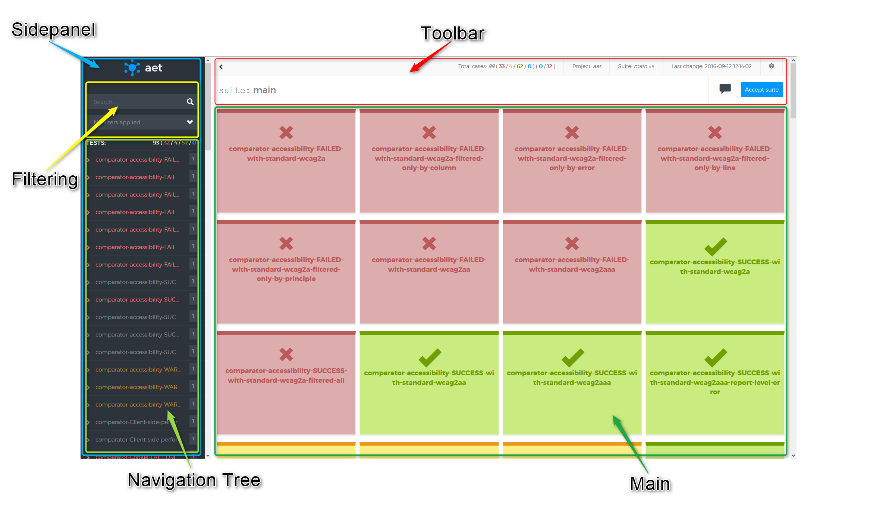

## Suite Report

### What is suite report?
Suite Report is testing results' presentation. It's composed of single tests. Each of them contains one or more URLs, on which tests were run.

| ! Important information |
|:----------------------- |
|AET reports are tested and written for Google Chrome web browser. |

Each test's result will be presented in one of three colors:

* **green** - if all group result passed and no risks was detected,
* **yellow** - if there is small risk detected,
* **red** - if there were some risks detected and result requires inspection

There is also 4th colour, which is not correlated with test's results. It is **blue**, which appears when user accepts certain pattern.

Report is made up of 3 main parts (see also screenshot below):

* toolbar,
* sidepanel (which contains two sub-parts):
  * filtering,
  * navigation-tree,
* main.

With given suite report you can:

* accept or revert patterns,
* create notes,
* filter results,
* search for specific test/URL,
* navigate on report with keyboard shortcuts.

For more information about AET reports' features see [[AET Report Features|SuiteReportFeatures]].

### Levels of report

The highest report's level is suite. Every suite contains tests and the certain test contains one or more URLs on which tests are run.

#### Suite
On this level you can see such information as:

* all tests which was launched via certain suite,
* project name,
* test cases' status,
* date and time of running the test suite.

#### Test
If you go to the certain test level, you can obtain information about:

* test case's name,
* status' representation of tested URLs,
* URLs included in the test.

#### URL with Cases Tabs
On URL level you can learn about:

* cases on which certain site was tested (represented as tabs on upper part of report),
* test case's details for given URL.
