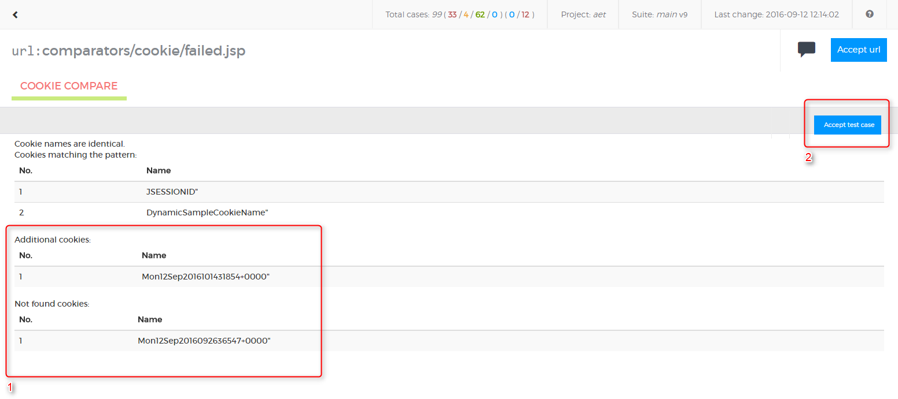

#### Cookies

##### Description
Cookie test results can be presented in three diffrent forms which depend on the action parameter defined in test definition. The forms are:

* list,
* test,
* compare.

##### List

###### Description
Lists all cookies found on the tested page. This result will always have success status.

##### What vulnerabilities it discovers
You can check all of site's cookies in order to find the invalid one. However, this mode is not intended to discover website issues. This list should be empty when tested page does not intend to use cookies and The EU Cookie Law is respected.

##### Test

###### Description
It shows result of checking presence of cookie with defined parameters on the tested page.

In case of cookie being not found on the page or having an unexpected value the result is marked as risk (red).

##### What vulnerabilities it discovers
There are a few things you should pay attention to:

* lack of a cookie that occurred before might be caused by some website error (e.g. bug in system functionality),
* lack of a cookie might result in further system erros (e.g. losing some user specific data),
* lack of an important cookie (e.g. cookie with user localization data) may cause a page to be dispalyed improperly.

##### Compare

###### Description
Cookies found on the tested page are compared to the others, which were saved in the pattern (if there is no pattern, then cookies collected during the first page entry are set as the pattern). Differences are searched only for cookies' names. Result will be successful if all found cookies' names are identical to those in the pattern.

Otherwise the result in the report will be marked as at risk (red). Differences will be presented in the form (see "1" on screenshot below) and there will be "accept test case" action available (see "2" on screenshot below).

##### What vulnerabilities it discovers
* lack of a cookie that occurred before might be caused by some website error (e.g. bug in system functionality),
* lack of a cookie might result in further system erros (e.g. losing some user specific data),
* an additional cookie may be generated by some unwanted content on a page (e.g. some 3rd party software add own cookies),
* when a page does not intend to use cookies and The EU Cookie Law is respected, lists of additional and detected cookies should always be empty.