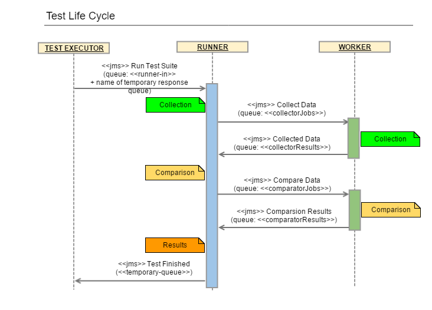

## Test Processing

Each AET test processing consists of two phases:

* collection,
* comparison,

After report is generated, client is notified about the finished test run.

The following diagram shows the life cycle of single test:

### Collection

This is the first phase during which all specified data will be collected (e.g. screenshots, page source, js errors). All collection results are saved in database after successful collection.

### Comparison

The second phase is operation on collected data. In some cases collected data is compared to patterns, in other special validation is performed (e.g. w3c). The second phase starts before collection finishes - just at the moment when required artefacts are collected and ready to compare (e.g. to compare two screenshots, system does not have to wait until source of page is collected).

The following diagram shows the life cycle of test suite:

