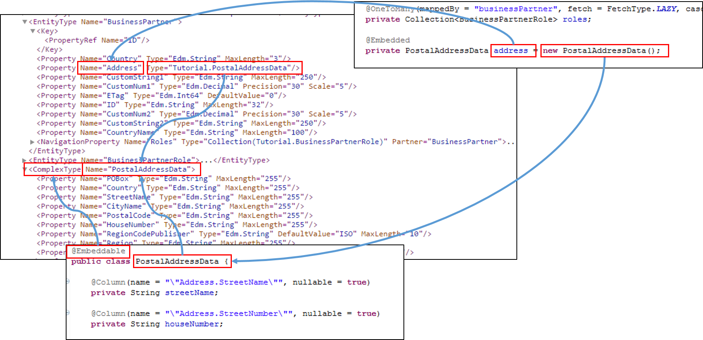

# 1.5: Use Complex Types
The first version of our business partner was very simple and did not contain information about the address or the information about the user that created or changed the business partner. This is what we want to do now.   
First we want to introduce the address. The assumption is that the fields of the address shall be reusable, so be used later also in another entity, which is the reason for defining it in a separate class:
```Java
package tutorial.model;

import javax.persistence.Column;
import javax.persistence.Embeddable;

@Embeddable
public class PostalAddressData {
    
    @Column(name = "\"Address.StreetName\"", nullable = true)
    private String streetName;
    
    @Column(name = "\"Address.StreetNumber\"", nullable = true)
    private String houseNumber;
    
    @Column(name = "\"Address.PostOfficeBox\"", nullable = true)
    private String POBox;
    
    @Column(name = "\"Address.PostalCode\"")
    private String postalCode;
    
    @Column(name = "\"Address.City\"")
    private String cityName;
    
    @Column(name = "\"Address.Country\"")
    private String country;
    
    @Column(name = "\"Address.RegionCodePublisher\"", length = 10)
    private String regionCodePublisher = "ISO";
    
    @Column(name = "\"Address.RegionCodeID\"", length = 10)
    private String regionCodeID = "3166-2";
    
    @Column(name = "\"Address.Region\"")
    private String region;
    
    @EdmDescriptionAssozation(languageAttribute = "key/language", descriptionAttribute = "name")
    @OneToMany(fetch = FetchType.LAZY, cascade = CascadeType.ALL)
    @JoinColumns({
        @JoinColumn(name = "\"CodePublisher\"", referencedColumnName = "\"Address.RegionCodePublisher\"", nullable = false, insertable = false, updatable = false),
        @JoinColumn(name = "\"CodeID\"", referencedColumnName = "\"Address.RegionCodeID\"", nullable = false, insertable = false, updatable = false),
        @JoinColumn(name = "\"DivisionCode\"", referencedColumnName = "\"Address.Region\"", nullable = false, insertable = false, updatable = false)
    })
    private Collection<AdministrativeDivisionDescription> regionName;    
}
```
Now we can add the PostalAddressData to the BusinessPartner:  
```Java
public class BusinessPartner {
    ...
    @OneToMany(mappedBy = "businessPartner", fetch = FetchType.LAZY, cascade = CascadeType.REMOVE)
    private Collection<BusinessPartnerRole> roles;
    
    @Embedded
    private PostalAddressData address = new PostalAddressData();
    
    public BusinessPartner() {
        super();
    }
    ...
```
After adding tutorial.model.PostalAddressData to the persistence.xml we can have already a look at the first step: _http://localhost:8080/Tutorial/Tutorial.svc/$metadata_	

  

Second we want to introduce AdministrativeInformation, which is a bit more complicated as it has two groups of identical fields. The person that made a change and a time stamp giving the point in time when the change was made. This leads to nested embedded types. Lets start with the inner type:  
```Java
package tutorial.model;

import java.sql.Timestamp;

import javax.persistence.Column;
import javax.persistence.Embeddable;

@Embeddable
public class ChangeInformation {

    @Column
    private String by;
    @Column
    private Timestamp at;
}
```
This is now used within AdministrativeInformation:
```Java
package tutorial.model;

import javax.persistence.Embeddable;
import javax.persistence.Embedded;

@Embeddable
public class AdministrativeInformation {

    @Embedded
    private ChangeInformation created;
    @Embedded
    private ChangeInformation updated;
}
```
We can now add the AdministrativeInformation to the Business Partner:
```Java
public class BusinessPartner {
    ...
    @Embedded
    private PostalAddressData address = new PostalAddressData();
    
    @Embedded
    private AdministrativeInformation administrativeInformation = new AdministrativeInformation();  
```
And, after adding both classes to the persistence.xml, we can have a look at the result: _http://localhost:8080/Tutorial/Tutorial.svc/$metadata_	

Before we go ahead, we want to do a small preparation step for the second set of tutorials. As of now we can see the AdministrativeInformation in our metadata document, 
but we won't be able to retrieve them. You may have noticed, that there a no column names given in ChangeInformation. We can't do that as we use ChangeInformation twice.
Instead of that we have to "rename" the fields within AdministrativeInformation:
```Java
...
@Embeddable
public class AdministrativeInformation {
	@Embedded
	@AttributeOverrides({ 
			@AttributeOverride(name = "by", column = @Column(name = "\"CreatedBy\"")),
			@AttributeOverride(name = "at", column = @Column(name = "\"CreatedAt\"")) })
	private ChangeInformation created;
	@Embedded
	@AttributeOverrides({ 
			@AttributeOverride(name = "by", column = @Column(name = "\"UpdatedBy\"")),
			@AttributeOverride(name = "at", column = @Column(name = "\"UpdatedAt\"")) })
	private ChangeInformation updated;
...
```


Next step: [Tutorial 1.6: Navigation Properties And Complex Types](1-6-NavigationAndComplexTypes.md)  